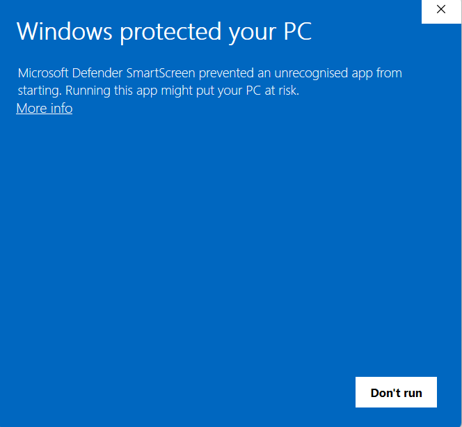
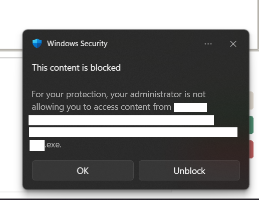

# Windows Installation

Download files from the **Windows** folder of the download (register at [crystogen.org](https://crystogen.org) to receive the link).

## GUI

### 1. Download

Download `CrystoGen-GUI-windows-x86_64.zip`.

### 2. Extract

Right-click the `.zip` file and select **Extract All**, then choose a destination folder (e.g. `C:\Program Files\CrystoGen` or your Desktop).

### 3. First launch — bypass SmartScreen

Windows may display a **"Windows protected your PC"** warning. See [Bypassing Windows SmartScreen](#bypassing-windows-smartscreen) below for instructions. On macOS, see [Bypassing Gatekeeper](macos.md#bypassing-gatekeeper) instead.

### 4. First launch — licence

On first launch, click **Update license** in the GUI and navigate to `CrystoGen.key` from the download folder.

### 5. Run

Open the extracted folder and double-click **CrystoGen-GUI.exe**.

---

## CLI

!!! note
    The CLI is recommended only for users comfortable working in the terminal. For HPC use, SLURM job templates are included in the **HPC_scripts** folder of the download.

### 1. Download

Two variants are available:

| File | Description |
|---|---|
| `crystogen-1.5.0-windows-x86_64.tar.gz` | Standard build |
| `crystogen-1.5.0-windows-x86_64-openmp.tar.gz` | OpenMP parallelised build (recommended for multi-core HPC nodes) |

### 2. Extract

Windows 10 and later include `tar.exe`. In a Command Prompt or PowerShell window:

```bat
tar -xzf crystogen-1.5.0-windows-x86_64.tar.gz
```

The archive extracts to a versioned folder. The `crystogen.exe` binary is inside the `bin\` subdirectory alongside `cg-preprocess` and `cg-decrypt-key`.

### 3. First launch — bypass SmartScreen

Windows SmartScreen may block the binary on first run. See [Bypassing Windows SmartScreen](#bypassing-windows-smartscreen) below for instructions. On macOS, see [Bypassing Gatekeeper](macos.md#bypassing-gatekeeper) instead.

### 4. Licence

Place `CrystoGen.key` in the directory from which you will run the simulation (your working directory). See [Licence key](../licence-key.md) for all configuration methods.

### 5. Run

```bat
cd \path\to\simulation\folder
\path\to\bin\crystogen.exe < addinput.txt
```

See [Running CrystoGen](../running.md) and [Input files](../input-files.md) for details on preparing `input.txt` and `addinput.txt`. Template input files are included in the **Structure Files/Input_files_CLI** folder of the download.

---

## Bypassing Windows SmartScreen

CrystoGen is not code-signed with a commercial certificate, so Windows SmartScreen may display a warning on first launch.

### "Windows protected your PC" dialog

If you see this dialog:



1. Click **More info** (below the warning text)
2. Click **Run anyway**

!!! info "Why does this happen?"
    SmartScreen flags executables that are new or have low download counts. This is expected for self-distributed software without a paid code-signing certificate. The application is safe to run.

### Antivirus false positives

Some antivirus tools flag PyInstaller-packaged executables. If the GUI or CLI binary is quarantined:

1. Restore it from quarantine
2. Add an exclusion for the CrystoGen folder

### "This content is blocked" dialog

On managed devices (e.g. university or institutional computers), Windows Security may block the executables that the GUI launches internally, showing this dialog:



This can appear up to three times — once for each executable the GUI invokes:

| When | Executable |
|---|---|
| On open | `cg-decrypt-key` (licence validation) |
| On loading a structure file | `cg-preprocess` |
| On running a calculation | `crystogen` |

Click **Unblock** each time the dialog appears. If it keeps reappearing, add an exclusion for the CrystoGen folder in Windows Security settings.

---

## ToposPro Light

A light version of ToposPro is included in the **ToposPro_Light** folder for topology analysis on Windows.

!!! warning "Being phased out"
    ToposPro Light is being phased out. Its functionality is superseded by [OCC](../occ.md). See the [ToposPro](../topospro.md) page for installation details.

---

## CG Visualiser

A Windows visualiser for CrystoGen output is included in the **CGVisualiser** folder.

!!! warning "Being phased out"
    CG Visualiser is being phased out. Its functionality is superseded by [CGAspects](https://github.com/CrystoGenLtd/cgaspects). See the [CG Visualiser](../cgvisualiser.md) page for installation details.

---

## Uninstalling

Delete the extracted folder. CrystoGen does not write to the Windows registry or create system-level files. To also remove logs, settings, and licence data, delete the `.crystogen` folder in your home directory:

```
C:\Users\<YourName>\.crystogen\
```
